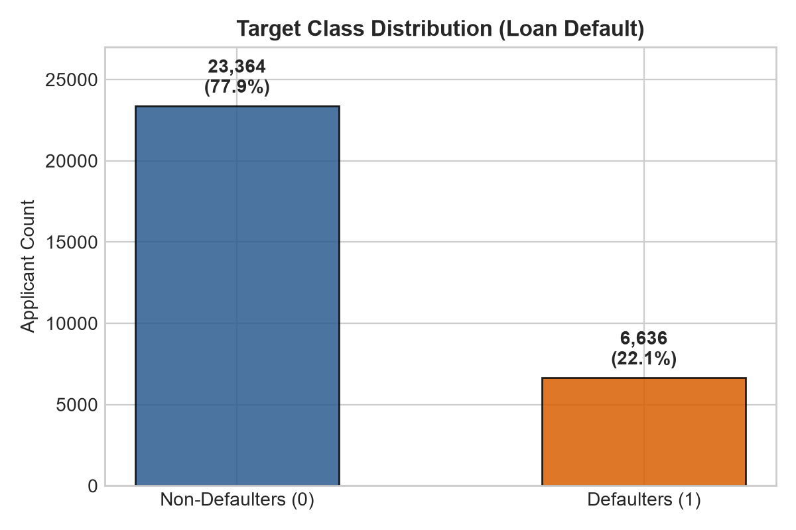
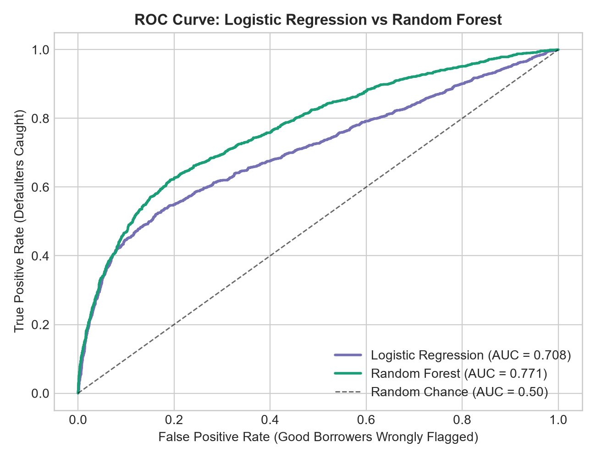
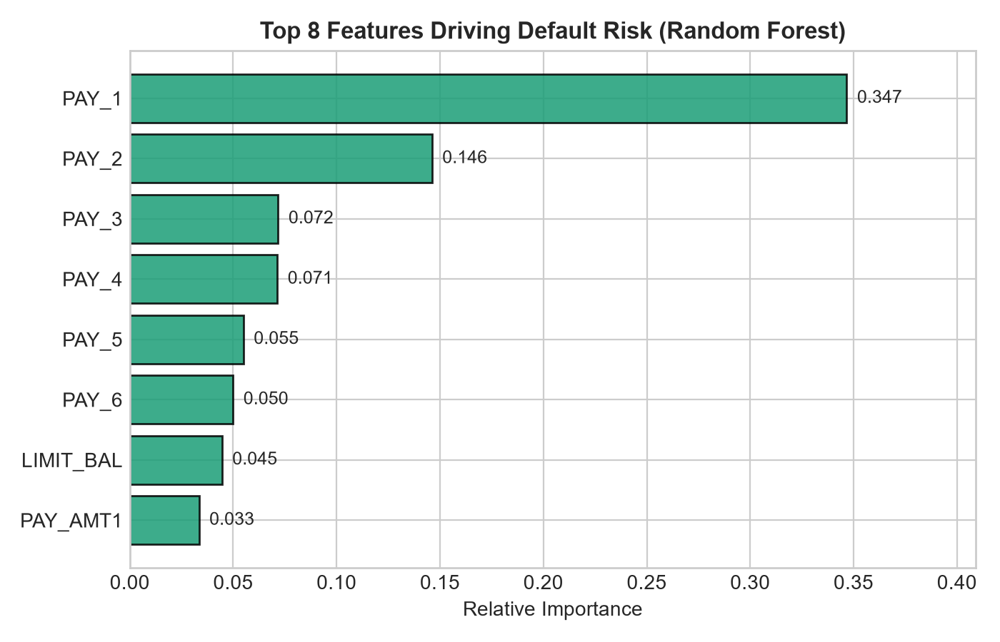

# Credit Risk: Loan Default Prediction

A machine learning project where I predict whether a credit card customer will default on their loan payment next month.


## The Problem
When a bank lends money or issues credit cards, it faces a trade-off:
- If it lends to someone who defaults, it loses the loaned amount.
- If it rejects someone who would have paid on time, it loses potential interest earnings.

My goal in this project was to build a simple machine learning model to help predict whether a customer is likely to default based on their past repayment history and credit profile.

---

## The Dataset
I used the **UCI Default of Credit Card Clients** dataset, which contains 30,000 customers.
- **Features**: Demographics (age, sex, education, marriage), credit limit, and 6 months of billing and payment records.
- **Target**: `default` (1 = defaulted next month, 0 = paid on time).
- **Class Imbalance**: About 78% of people paid on time and 22% defaulted (~3.5 to 1 ratio). Because defaults are the minority class, I used `class_weight='balanced'` in my models to stop them from just predicting "no default" every time.

<p align="center">
  
</p>

---

## What I Did
1. **Cleaned the Data**: Dropped the row ID, renamed the repayment columns so they were easy to follow (e.g., `PAY_1` for last month), and grouped a few undocumented categories in education and marriage into an "others" category.
2. **Explored the Data**: Checked the class imbalance and created visual charts to see how credit limits and late payments relate to defaults.
3. **Split the Data**: Split the data into 80% for training (24,000 rows) and 20% for testing (6,000 rows), making sure both sets had the same 22% default rate using stratified sampling.
4. **Trained Two Models**:
   - **Logistic Regression**: A simple baseline model (with numeric features scaled using `StandardScaler`).
   - **Random Forest**: An ensemble of 100 decision trees with `max_depth=6` to prevent overfitting.
5. **Evaluated on Test Data**: Evaluated both models at the standard 0.5 probability threshold.

---

## Project Structure

```
credit-risk-prediction/
??? README.md
??? requirements.txt
??? data/
?   ??? UCI_Credit_Card.csv
??? notebook.ipynb          # everything happens here: cleaning, EDA, modeling, evaluation
??? figures/                # saved chart images, referenced with relative paths
    ??? class_imbalance.png
    ??? features_distribution.png
    ??? correlation_heatmap.png
    ??? roc_curve.png
    ??? feature_importance.png
```

---

## Results

I evaluated both models on the held-out test set (6,000 customers):

| Model | Accuracy | Precision | Recall | F1-score | ROC-AUC |
| :--- | :---: | :---: | :---: | :---: | :---: |
| **Logistic Regression** | 68.0% | 36.7% | 62.0% | 0.4612 | 0.7084 |
| **Random Forest** | **77.8%** | **49.8%** | **58.5%** | **0.5381** | **0.7713** |

<p align="center">
  
</p>

---

## What I Found
- **Random Forest performed best**: It achieved a **77.8% Accuracy** and an **ROC-AUC of 0.7713**, clearly outperforming Logistic Regression.
- **Recent payment delays are the biggest clue**: Looking at the feature importance chart below, `PAY_1` (repayment status last month) and previous months' payment delays (`PAY_2`, `PAY_3`) were by far the strongest predictors of default. If a borrower is already 2+ months late, their chance of default jumps over 50%.
- **Decision threshold note**: I used the standard 0.5 cutoff for predictions. A lending business could lower this cutoff (e.g., to 0.40) to catch more defaulters before lending to them, though it would also turn away more good customers.

<p align="center">
  
</p>

---

## How to Run It

1. **Install dependencies**:
   ```bash
   pip install -r requirements.txt
   ```

2. **Run the Notebook**:
   Open and run `notebook.ipynb` in Jupyter or VS Code to see the full data cleaning, charts, and model training.
